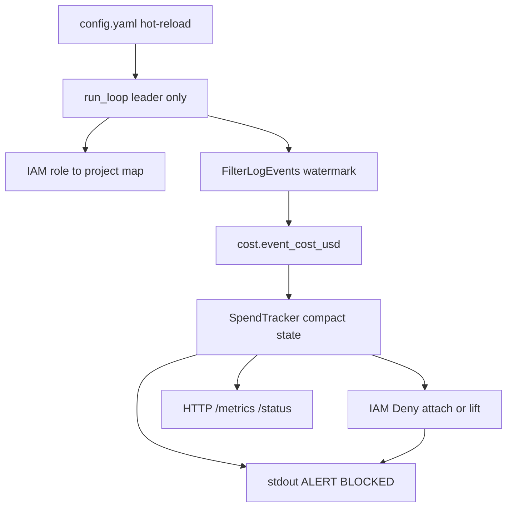

# Bedrock Budget Guard — Design

This document explains **what the product does and why**. For commands and
config knobs, see [README.md](README.md).

## The problem

Teams share one AWS account (or a local emulator). Workloads call Amazon
Bedrock under different IAM roles. Without guardrails, one project can burn
the day’s budget for everyone—or surprise Finance after the fact.

We need a small control plane that:

1. **Tracks** spend so far today (UTC calendar day), **per project**.
2. **Alerts** when spend crosses agreed fractions of the daily budget.
3. **Enforces** by stopping further Bedrock use for that project when the
   budget is exhausted—and **lifts** the stop when it no longer applies.

Budgets are measured in **US dollars of estimated usage**, not raw token
counts. Tokens are only an input to pricing.

## Who it is for

| Audience | What they care about |
|---|---|
| FinOps / Finance | Dollar caps, clear meaning of `budget_usd`, predictable pricing |
| Platform / IAM | Safe enforcement that does not break existing Allow policies |
| On-call / operators | Fast unblock without waiting for midnight; readable logs |

## Product behavior (v1)

### Architecture



Each poll: reload config → optional UTC day roll → refresh IAM map →
incremental logs → price & accumulate → alert / enforce → persist compact
state. Only the leader replica runs this loop; standbys serve HTTP.

In Kubernetes, two replicas share a `Lease` (leader election) and a
ConfigMap for compact state. Local demo still uses `state.json` on a volume.

### Runtime shape

A **long-running daemon** (Compose service or process), not a cron job. Every
few seconds it reloads config, reads new invocation logs, updates spend, then
alerts and enforces. That keeps reaction time short and lets config edits
(including unblock) apply on the next poll.

### Project identity

A “project” is the IAM role tag `project` (local demo values: `alpha`,
`beta`, `shared`). Several roles can share one project. Spend is summed
across those roles; when the project is blocked, **every** role with that
tag gets the Deny. That is intentional: one hot path must not leave a
sibling role free to keep spending the same budget.

Roles whose project tag is **missing from config** produce a warning and
are **never** auto-blocked. We do not invent budgets.

### Cost model

Each log event is priced as:

```
cost_usd = (input×input_rate + output×output_rate
            + cache_read×cache_read_rate + cache_write×cache_write_rate)
           / 1_000_000
```

Rates live in config (`pricing_per_million_usd`). Cache read/write are
billed separately from normal input—same idea as real Bedrock pricing.
`budget_usd` is the **dollar ceiling** for the UTC day.

Demo rates follow public **US-style** list prices so the local simulator’s
~\$1.2/min alpha traffic hits a ~\$2 budget in about two minutes. Real
`eu-west-1` prices can differ (often ~10% higher). See Future features.

### Alerts

Human-readable lines on stdout (`STATUS`, `ALERT`, `BLOCKED`,
`UNBLOCKED`, `WARN`). Thresholds (for example 80% and 100%) fire **once
per project per threshold per UTC day** (persisted across restarts within
the same UTC day). Operators use `make logs-guard` in the local demo.

Optional Slack Incoming Webhooks are driven by `alerts.slack` in config
(hot-reloaded). Default events are `ALERT` / `BLOCKED` / `UNBLOCKED` —
not `STATUS`. `SLACK_WEBHOOK_URL` overrides `webhook_url`. Failures are
soft (`WARN` on stdout).

`BLOCKED` is emitted only when at least one `put_role_policy` succeeds.
If every IAM put fails, we warn and retry on the next poll — we do not
claim the project is paused.

### Fail-open

If `FilterLogEvents` fails, the poll keeps last known spend, does not
advance the watermark, and does **not** attach a blanket Deny. Existing
blocks stay in IAM; new spend is not counted until logs work again.
IAM put failures are the same: warn, increment metrics, retry next poll.

This is intentional: a CloudWatch outage must not pause every project.
SRE must page on `budget_guard_log_fetch_errors_total` and
`budget_guard_iam_put_failures_total` instead.

### Observability

Port **8080** (override `BUDGET_GUARD_HTTP_PORT`):

| Path | Purpose |
|---|---|
| `/metrics` | Prometheus (FinOps gauges + SRE counters) |
| `/healthz` | Process up |
| `/readyz` | Ready to serve (standby and leader) |
| `/status` | JSON spend vs budget, `last_poll_ok`, `last_error` |

Grafana: import [deploy/grafana/budget-guard.json](deploy/grafana/budget-guard.json).
FinOps panels filter `budget_guard_is_leader == 1` so standby scrapes do
not zero the charts.

### Enforcement and lift

When `enforce: true` and spend ≥ budget, we attach an inline IAM policy
`BudgetGuardDenyBedrock` (Deny on invoke/converse). We **never** detach or
edit existing Allow policies (for example a seeded `BedrockInvokeAccess`)—
explicit Deny wins in IAM.

Lift happens when:

- spend is under budget again (for example after you raise `budget_usd`), or
- `enforce` is set to `false`, or
- the UTC day rolls over (counters reset and managed Denys are removed).

Preferred same-day unblock for operators: set `enforce: false`, wait one
poll, then set it back to `true` when automatic control should resume.

## Important design choices

### Why FilterLogEvents (not Logs Insights)

Against the pinned local ministack, Insights `stats … by` aggregations come
back empty even when the query says Complete. We therefore read events with
`FilterLogEvents` and aggregate ourselves. The same path works against real
AWS CloudWatch Logs.

That API can return large pages; we **do not** re-scan the whole day. We
keep a watermark and only fetch what is new, with a short overlap. Overlap
duplicates are dropped by an **in-memory** `eventId` set limited to the
overlap window. Against ministack, each poll stops at 1000 events; against
real AWS we paginate until the page is empty.

### Why a daemon with hot-reloaded config

Budgets, thresholds, and “please unblock alpha” are operational levers.
Editing a mounted `config.yaml` without rebuilding the image matches how
FinOps and on-call actually work. A scheduled one-shot job would be
slower to react and awkward for unblock.

### Why compact persisted state (not a full event log)

Spend, watermark, fired thresholds, and the blocked-project set are
written after every poll. Seen event IDs are **not** persisted — they
exist only to dedup the overlap window in the running process.

- **Local demo:** `state.json` (`BUDGET_GUARD_STATE`, default
  `/app/state/state.json`).
- **Kubernetes:** the same JSON in ConfigMap `budget-guard-state`. That is
  small enough for etcd and avoids DynamoDB.

A mid-day restart or failover resumes from the watermark. The first fetch
after restore starts at `watermark + 1` (no overlap) so already-counted
spend is not priced twice. IAM Deny discovery still merges lingering
blocks if state is missing.

If the ConfigMap is missing, we **fail-open**: watermark at now − 60s,
empty spend, no new Deny until real traffic is counted.

State for a previous UTC day is discarded on load (same semantics as day
roll). Locally, `make down` uses `down -v` and wipes the Compose volume —
fresh demos start clean. `make aws-down` does **not** delete the volume.

### High availability

Two Deployment replicas. A Kubernetes `Lease` (`coordination.k8s.io`)
picks one leader. Followers serve `/metrics` and `/healthz` with
`budget_guard_is_leader 0`. Before IAM mutate, the leader re-checks the
lease (fence) so a slow poll cannot Deny after losing leadership.

SIGTERM flushes compact state and exits; the lease expires and the
standby takes over.

### Pricing source of truth in v1

Operators own rates in config (`pricing_as_of` comment). There is no live
AWS Price List call in v1 (SKU ↔ `modelId` mapping is fragile). Config
remains the override even if sync is added later.

### Local vs real AWS

`AWS_ENDPOINT_URL` is optional. Set it for ministack (or any custom
endpoint); leave it unset for standard AWS. Seed and generator are demo-only;
the guard itself needs only Logs + IAM. Kubernetes (two replicas, Lease,
ConfigMap state) is the production shape; see High availability above.

## Future features

Not built yet; listed so the roadmap is explicit.

### Per-region pricing model

Price by region (or sync from the AWS Price List / Bulk API), so
`eu-west-1` vs US list prices stay accurate. Config should remain a
manual override; sync must fail soft if the price API is unreachable.

### Alerts

Push notifications beyond Slack Incoming Webhooks—PagerDuty, email, or
richer routing by project—with the same once-per-threshold semantics.
Stdout stays useful for local review.
