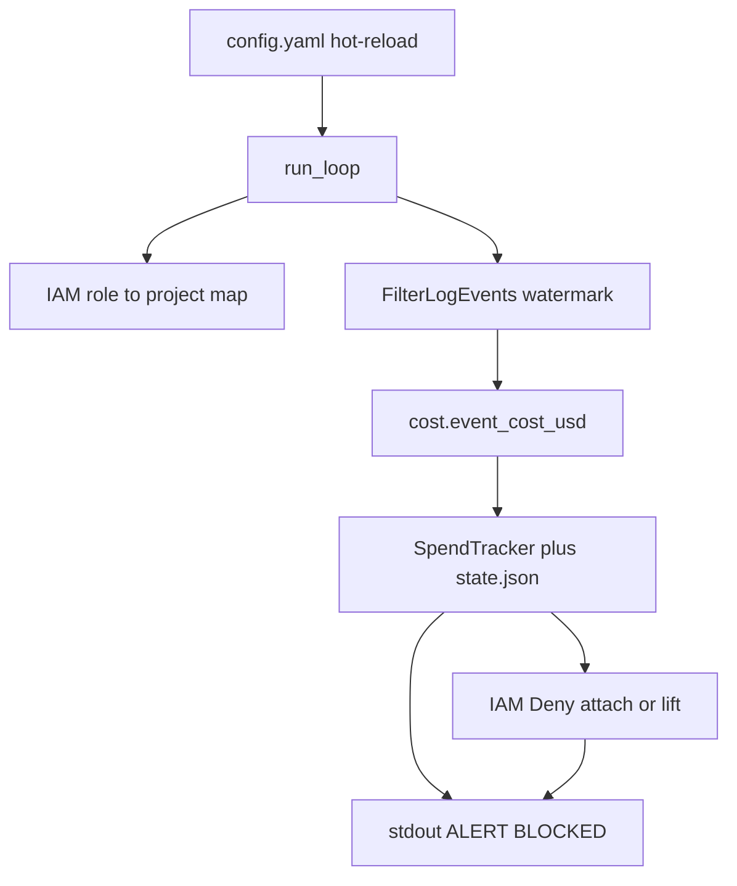

# Bedrock Budget Guard — Design

This document explains **what the product does and why**. For commands and
config knobs, see [README.md](README.md).

## The problem

Teams share one AWS account (or a local emulator). Workloads call Amazon
Bedrock under different IAM roles. Without guardrails, one project can burn
the day’s budget for everyone—or surprise Finance after the fact.

We need a small control plane that:

1. **Tracks** spend so far today (UTC calendar day), **per project**.
2. **Alerts** when spend crosses agreed fractions of the daily budget.
3. **Enforces** by stopping further Bedrock use for that project when the
   budget is exhausted—and **lifts** the stop when it no longer applies.

Budgets are measured in **US dollars of estimated usage**, not raw token
counts. Tokens are only an input to pricing.

## Who it is for

| Audience | What they care about |
|---|---|
| FinOps / Finance | Dollar caps, clear meaning of `budget_usd`, predictable pricing |
| Platform / IAM | Safe enforcement that does not break existing Allow policies |
| On-call / operators | Fast unblock without waiting for midnight; readable logs |

## Product behavior (v1)

### Architecture



Each poll: reload config → optional UTC day roll → refresh IAM map →
incremental logs → price & accumulate → alert / enforce → persist state.

### Runtime shape

A **long-running daemon** (Compose service or process), not a cron job. Every
few seconds it reloads config, reads new invocation logs, updates spend, then
alerts and enforces. That keeps reaction time short and lets config edits
(including unblock) apply on the next poll.

### Project identity

A “project” is the IAM role tag `project` (local demo values: `alpha`,
`beta`, `shared`). Several roles can share one project. Spend is summed
across those roles; when the project is blocked, **every** role with that
tag gets the Deny. That is intentional: one hot path must not leave a
sibling role free to keep spending the same budget.

Roles whose project tag is **missing from config** produce a warning and
are **never** auto-blocked. We do not invent budgets.

### Cost model

Each log event is priced as:

```
cost_usd = (input×input_rate + output×output_rate
            + cache_read×cache_read_rate + cache_write×cache_write_rate)
           / 1_000_000
```

Rates live in config (`pricing_per_million_usd`). Cache read/write are
billed separately from normal input—same idea as real Bedrock pricing.
`budget_usd` is the **dollar ceiling** for the UTC day.

Demo rates follow public **US-style** list prices so the local simulator’s
~\$1.2/min alpha traffic hits a ~\$2 budget in about two minutes. Real
`eu-west-1` prices can differ (often ~10% higher). See Future features.

### Alerts

Human-readable lines on stdout (`STATUS`, `ALERT`, `BLOCKED`,
`UNBLOCKED`, `WARN`). Thresholds (for example 80% and 100%) fire **once
per project per threshold per UTC day** (persisted across restarts within
the same UTC day). Operators use `make logs-guard` in the local demo.

`BLOCKED` is emitted only when at least one `put_role_policy` succeeds.
If every IAM put fails, we warn and retry on the next poll — we do not
claim the project is paused.

### Enforcement and lift

When `enforce: true` and spend ≥ budget, we attach an inline IAM policy
`BudgetGuardDenyBedrock` (Deny on invoke/converse). We **never** detach or
edit existing Allow policies (for example a seeded `BedrockInvokeAccess`)—
explicit Deny wins in IAM.

Lift happens when:

- spend is under budget again (for example after you raise `budget_usd`), or
- `enforce` is set to `false`, or
- the UTC day rolls over (counters reset and managed Denys are removed).

Preferred same-day unblock for operators: set `enforce: false`, wait one
poll, then set it back to `true` when automatic control should resume.

## Important design choices

### Why FilterLogEvents (not Logs Insights)

Against the pinned local ministack, Insights `stats … by` aggregations come
back empty even when the query says Complete. We therefore read events with
`FilterLogEvents` and aggregate ourselves. The same path works against real
AWS CloudWatch Logs.

That API can return large pages; we **do not** re-scan the whole day. We
keep a watermark and only fetch what is new, with a short overlap. Overlap
duplicates are dropped by `eventId` (or a synthetic key when an emulator
omits `eventId`).

### Why a daemon with hot-reloaded config

Budgets, thresholds, and “please unblock alpha” are operational levers.
Editing a mounted `config.yaml` without rebuilding the image matches how
FinOps and on-call actually work. A scheduled one-shot job would be
slower to react and awkward for unblock.

### Why file-backed state (not only memory)

Spend, watermark, fired thresholds, seen event IDs, and the blocked-project
set are written to `state.json` after every poll (`BUDGET_GUARD_STATE`,
default `/app/state/state.json`). A mid-day restart resumes without
re-alerting or undercounting from a cold watermark.

As a safety net, startup also **discovers** roles that already carry
`BudgetGuardDenyBedrock` and merges those projects into the blocked set.
That covers a missing/corrupt state file while Denys still linger in IAM.

State for a previous UTC day is discarded on load (same semantics as day
roll). Locally, `make down` uses `down -v` and wipes the Compose volume —
fresh demos start clean.

### Pricing source of truth in v1

Operators own rates in config (`pricing_as_of` comment). There is no live
AWS Price List call in v1 (SKU ↔ `modelId` mapping is fragile). Config
remains the override even if sync is added later.

### Local vs real AWS

`AWS_ENDPOINT_URL` is optional. Set it for ministack (or any custom
endpoint); leave it unset for standard AWS. Seed and generator are demo-only;
the guard itself needs only Logs + IAM.

## Future features

Not built yet; listed so the roadmap is explicit.

### Stronger durability

Replicate or back up `state.json` (or move to a small store) for
multi-replica / multi-host deployments. Today a single daemon + volume
(or local file) is enough.

### Per-region pricing model

Price by region (or sync from the AWS Price List / Bulk API), so
`eu-west-1` vs US list prices stay accurate. Config should remain a
manual override; sync must fail soft if the price API is unreachable.

### Dashboards

Export metrics or a simple view of spend vs budget over the UTC day
(per project, maybe per role). Logs are enough to demo; dashboards help
FinOps day to day.

### Alerts

Push notifications beyond container stdout—webhooks, Slack, PagerDuty,
or email—with the same once-per-threshold semantics (and routing by
project). Stdout stays useful for local review.
